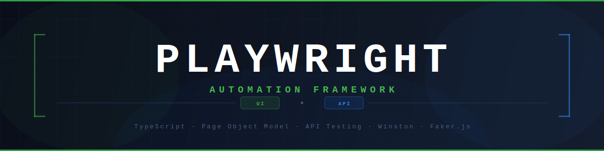
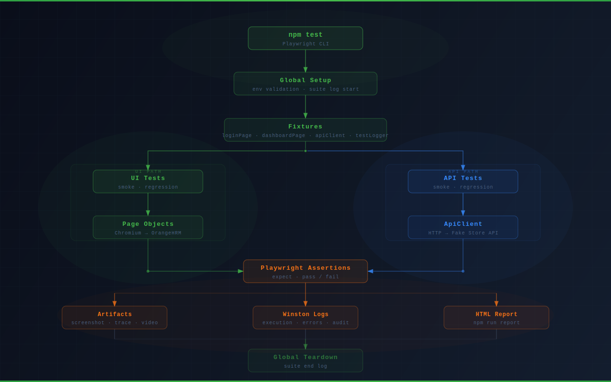

<div align="center">

<br />



<br /><br />

[](https://playwright.dev)
[](https://www.typescriptlang.org)
[](https://nodejs.org)
[](LICENSE)

[](https://playwright.dev/docs/pom)
[](https://github.com/motdotla/dotenv)
[](https://github.com/winstonjs/winston)
[](https://www.microsoft.com/windows)

<br />

</div>

---

## Overview

A production-ready Playwright automation framework built with TypeScript. Covers both **UI testing** ([OrangeHRM demo](https://opensource-demo.orangehrmlive.com)) and **API testing** ([Fake Store API](https://fakestoreapi.com)) using the Page Object Model pattern, centralised environment config, and structured Winston logging.

---

## Framework Flow



---

## Tech Stack

| Layer | Technology | Purpose |
|---|---|---|
| Test runner | [Playwright](https://playwright.dev) v1.60 | Browser automation, API testing & assertions |
| Language | [TypeScript](https://typescriptlang.org) v5.x | Type safety across the whole framework |
| Architecture | Page Object Model | Separation of locators, actions, and tests |
| Config | [dotenv](https://github.com/motdotla/dotenv) | Environment-specific variables via `.env.qa` |
| Logging | [Winston](https://github.com/winstonjs/winston) | Structured, rotating log files |
| Test data | [@faker-js/faker](https://fakerjs.dev) v9.9 | Dynamic payload generation for API tests |
| Browser | Chromium (Desktop Chrome) | Default project; easily extended |
| Code graph | [graphify](https://github.com/nicholasgasior/graphify) | AST knowledge graph for codebase navigation |

---

## Folder Structure

```
playwright-framework/
│
├── api/
│   ├── clients/
│   │   └── ApiClient.ts         # HTTP client: URL builder, logger, context capture
│   ├── endpoints/
│   │   └── ProductEndpoints.ts  # Endpoint path constants
│   ├── models/
│   │   └── Product.ts           # TypeScript interfaces for request / response shapes
│   └── schemas/
│       └── ProductSchema.ts     # Runtime type guard for product field validation
│
├── configs/
│   ├── env.ts                   # Loads .env.qa — single dotenv entry point
│   ├── validation.ts            # Validates required env vars at startup
│   ├── globalSetup.ts           # Suite-start log entry
│   └── globalTeardown.ts        # Suite-end log entry
│
├── fixtures/
│   └── index.ts                 # Extended test: page objects, apiClient, auto-logger
│
├── pages/
│   ├── BasePage.ts              # Abstract base: shared page utilities
│   ├── LoginPage.ts             # Login locators + navigate/login/verify methods
│   └── DashboardPage.ts         # Post-login URL verification
│
├── utils/
│   ├── fakerHelper.ts           # productFactory — generates random product payloads
│   └── logger.ts                # Winston: console + 3 rotating file transports
│
├── tests/
│   ├── smoke/
│   │   └── TC001-login-success.spec.ts
│   ├── regression/
│   │   └── TC002-login-invalid-password.spec.ts
│   └── api/
│       ├── smoke/
│       │   ├── TC001-get-products.spec.ts
│       │   └── TC002-create-product.spec.ts
│       └── regression/
│           ├── TC003-update-product.spec.ts
│           ├── TC004-delete-product.spec.ts
│           └── TC005-invalid-product.spec.ts
│
├── logs/                        # Winston output (git-ignored content)
│   ├── execution/               # All info+ events — 14-day retention
│   ├── errors/                  # Error-level only — 30-day retention
│   └── audit/                   # Compliance trail — 90-day retention
│
├── test-results/                # Playwright artifacts per run (git-ignored)
├── playwright-report/           # HTML report — open with `npm run report` (git-ignored)
│
├── .env.qa                      # Environment variables (never commit secrets)
├── playwright.config.ts
├── tsconfig.json
└── package.json
```

---

## Prerequisites

- **Node.js** v20 or later
- **npm** v9 or later

---

## Installation

```bash
# 1. Clone the repository
git clone <repository-url>
cd playwright-framework

# 2. Install dependencies
npm install

# 3. Install Playwright browsers
npx playwright install chromium
```

---

## Configuration

All environment variables live in `.env.qa`. Never commit this file.

```env
BASE_URL=https://opensource-demo.orangehrmlive.com/web/index.php/auth/login
USERNAME=Admin
PASSWORD=admin123
HEADLESS=false
API_BASE_URL=https://fakestoreapi.com
```

| Variable | Description | Required |
|---|---|---|
| `BASE_URL` | Application login URL | ✅ |
| `USERNAME` | Test account username | ✅ |
| `PASSWORD` | Test account password | ✅ |
| `HEADLESS` | Run browser headless (`true` / `false`) | ✅ |
| `API_BASE_URL` | Base URL for API tests | ✅ |
| `LOG_LEVEL` | Winston log level (`debug` / `info` / `warn` / `error`) | optional — defaults to `info` |

> **How it works:** `configs/env.ts` calls `dotenv.config()` once at import time with `override: true` so `.env.qa` values always win over OS-level variables (important on Windows where `USERNAME` is a reserved system variable). All other files import the typed `config` object — `process.env` is never read directly outside this file.

---

## Running Tests

> **Execution model:** Tests run sequentially (`workers: 1`, `fullyParallel: false`). This keeps log output ordered and avoids shared-state races on the demo site.

```bash
# Run all tests
npm test

# Run UI smoke tests
npm run test:smoke

# Run UI regression tests
npm run test:regression

# Run all API tests
npm run test:api

# Run API smoke tests only
npm run test:api:smoke

# Run API regression tests only
npm run test:api:regression

# Run with browser visible
npm run test:headed

# Type-check without running tests
npm run typecheck

# Open the HTML report
npm run report
```

### Running a Specific Test

```bash
# By full file path
npx playwright test tests/api/smoke/TC001-get-products.spec.ts

# By filename fragment (no path needed)
npx playwright test TC001-get-products

# By test title (supports regex)
npx playwright test TC001-get-products --grep "should return a list"

# Headed so you can watch it
npx playwright test TC001-get-products --headed

# Step through with the debugger
npx playwright test TC001-get-products --debug

# Pick and re-run tests interactively
npx playwright test --ui
```

### CI behaviour

When the `CI` environment variable is set, the runner automatically:

- **Retries** each failing test up to **2 times** before marking it failed
- **Fails fast** if any `test.only` call is left in the codebase (`forbidOnly`)

---

## Test Suite

### UI Tests

| ID | Suite | Test name |
|---|---|---|
| TC001 | Smoke | `[Login] should allow user access with valid credentials` |
| TC002 | Regression | `[Login] should display an error when credentials are invalid` |

### API Tests — Fake Store API

| ID | Suite | Test name |
|---|---|---|
| TC001 | Smoke | `[Products] should return a list of all available products` |
| TC002 | Smoke | `[Products] should create a new product with valid data` |
| TC003 | Regression | `[Products] should update a product when valid data is provided` |
| TC004 | Regression | `[Products] should remove a product and return the deleted record` |
| TC005 | Regression | `[Products] should return an empty response when the product does not exist` |

---

## Page Objects

### `BasePage`
Abstract class inherited by all page objects. Holds `protected page: Page` and shared helpers (`waitForPageLoad`, `getCurrentUrl`).

### `LoginPage`
| Method | Description |
|---|---|
| `navigate()` | Goes to `config.baseUrl` |
| `login(user, pass)` | Fills username and password, then submits |
| `verifyLoginPageDisplayed()` | Asserts URL matches `/auth\/login/` |
| `verifyErrorMessage(text)` | Asserts the error alert contains the given text |

### `DashboardPage`
| Method | Description |
|---|---|
| `verifyDashboardLoaded()` | Asserts URL matches `/dashboard\/index/` |

---

## Fixtures

`fixtures/index.ts` extends Playwright's `test` with:

| Fixture | Type | Description |
|---|---|---|
| `loginPage` | `LoginPage` | Injected page object per test |
| `dashboardPage` | `DashboardPage` | Injected page object per test |
| `apiClient` | `ApiClient` | HTTP client; attaches last request context to the HTML report on every run |
| `testLogger` | `void` (auto) | Logs TEST START → PASS/FAIL + duration for every test automatically |

---

## API Client

`api/clients/ApiClient.ts` wraps Playwright's `APIRequestContext`:

- Prepends `config.apiBaseUrl` to every endpoint path
- Sends `Content-Type: application/json` on all requests
- Logs every request and response at `info` level; full URL, headers, payload, and body at `debug` level
- Stores the last request context so the `apiClient` fixture can attach it to the HTML report

---

## Logging

Winston writes to three rotating transports simultaneously:

| File | Level | Retention | Purpose |
|---|---|---|---|
| `logs/execution/execution-YYYY-MM-DD.log` | `info` | 14 days | Full test run record |
| `logs/errors/error-YYYY-MM-DD.log` | `error` | 30 days | Failures + stack traces |
| `logs/audit/audit-YYYY-MM-DD.log` | `info` | 90 days | Compliance trail |

**What is logged:**

```
✅  Suite start / end
✅  Test start / end
✅  Pass / fail + duration
✅  Every API request and response (method, status, duration)
✅  Error messages with stack traces

❌  Every click / locator / navigation  (intentionally omitted)
```

**Sample output:**
```
12:41:16 [info] ════════════════════════════════════════════════
12:41:16 [info] SUITE START
12:41:17 [info] TEST START : [Products] should return a list of all available products
12:41:17 [info] REQUEST  : GET /products
12:41:17 [info] RESPONSE : 200 | 244ms
12:41:17 [info] TEST PASS  : [Products] should return a list of all available products | 259ms
12:41:17 [info] SUITE END
```

---

## Artifacts

On test failure, Playwright automatically captures:

| Artifact | Location |
|---|---|
| Screenshot | `test-results/` |
| Trace | `test-results/` — open with `npx playwright show-trace <file>` |
| Video | `test-results/` |
| Request context | Attached to the HTML report under the test's attachments tab |

All artifact folders are git-ignored. Run `npm run report` to open the HTML report.

---

## Applications Under Test

| Type | Name | URL |
|---|---|---|
| UI | OrangeHRM Open Source Demo | https://opensource-demo.orangehrmlive.com |
| API | Fake Store API | https://fakestoreapi.com |

---

## Knowledge Graph (graphify)

This project uses [graphify](https://github.com/nicholasgasior/graphify) to generate an AST-based knowledge graph of the codebase. The graph lives in `graphify-out/` and gives Claude (and you) a fast, structured way to understand file relationships, module dependencies, and cross-cutting concepts — without grepping through every file manually.

### What it produces

| Output | Description |
|---|---|
| `graphify-out/graph.json` | Full AST graph — nodes are files/symbols, edges are imports and references |
| `graphify-out/GRAPH_REPORT.md` | Human-readable architecture summary with community clusters and god nodes |
| `graphify-out/wiki/index.md` | Auto-generated wiki for broad codebase navigation |

### Commands

```bash
# Build or rebuild the graph (no API cost — AST only)
npx graphify update .

# Query the graph by question
npx graphify query "where is the API client defined?"

# Find the relationship between two files or symbols
npx graphify path "ApiClient" "ProductEndpoints"

# Explain a specific concept in the codebase
npx graphify explain "fixture injection"
```

> Run `npx graphify update .` after any code change to keep the graph current.

---

## AI Development Guidelines

This project ships a [`CLAUDE.md`](CLAUDE.md) — a plain-text contract that tells Claude (AI) exactly how to behave when helping with this codebase. Every time Claude is invoked it reads this file first, so the rules apply automatically to every suggestion, edit, and code generation in this repo.

### The four principles

| # | Principle | Rule |
|---|---|---|
| 1 | **Think Before Coding** | State assumptions explicitly. Surface tradeoffs. Ask when something is unclear — don't guess silently. |
| 2 | **Simplicity First** | Write the minimum code that solves the problem. No speculative features, no abstractions for single-use code. |
| 3 | **Surgical Changes** | Touch only what the task requires. Match existing style. Don't refactor adjacent code that isn't broken. |
| 4 | **Goal-Driven Execution** | Turn every task into a verifiable goal. Define what "done" looks like before writing a single line. |

---

## Credits

The principles in [`CLAUDE.md`](CLAUDE.md) — think before coding, simplicity first, surgical changes, goal-driven execution — are influenced by **Andrej Karpathy** and his philosophy on how humans and AI should collaborate on software.

> *"The hottest new programming language is English."*
> — Andrej Karpathy

- [X / Twitter](https://x.com/karpathy)
- [GitHub](https://github.com/karpathy)
- [YouTube](https://www.youtube.com/@AndrejKarpathy)

---

<div align="center">

Built with [Playwright](https://playwright.dev) · [TypeScript](https://typescriptlang.org) · [Winston](https://github.com/winstonjs/winston) · [Faker.js](https://fakerjs.dev)

</div>
